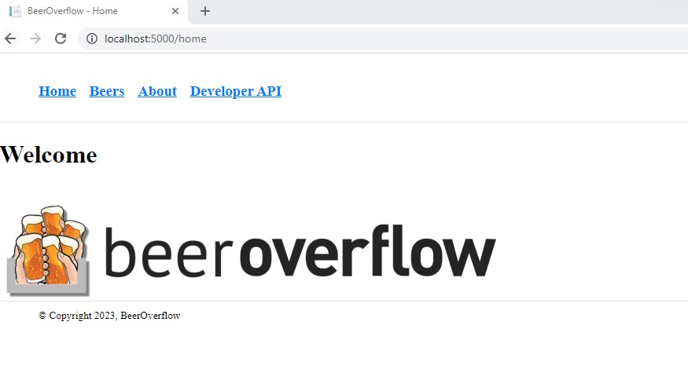

# Beers Overflow

Beers Overflow is currently a work in progress.
It contains the prototyping development of a basic MVC project in C#, following
the lections provided by [Telerik Akademy C# Alpha training](https://www.telerikacademy.com/alpha/csharp)

Functionality available:
(To be completed)

Skills trained and exercised:
1. Entity Framework: Deploy models corresponding to a database structure
2. Create Data structure to seed SQL data
3. Use Entity Framework migration to create the SQL database and transfer data to the tables
4. Create layered architecture with Repositories, Services and Controllers to realize segregation of duties approach
5. Implement API controllers communicating with the Service layer with endpoints accessible via API client (Postman)
6. Implement MVC controllers communicating with the Service layer with actions returning Razor Views
7. Implement Razor views containing HTML code for web representation
8. Transfer data from the MVC controller to the Razor view via Model variable, ViewData dictionary and DataBag object
9. Use shared views via the Views/Shared folder and shared resources via wwwroot folder
10. Navigate between Razor views